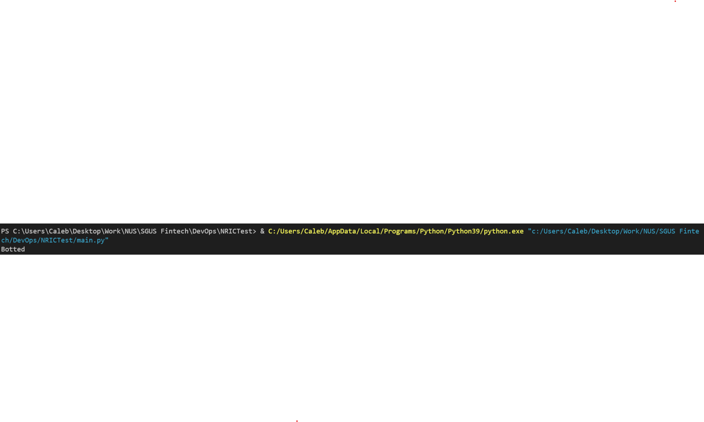
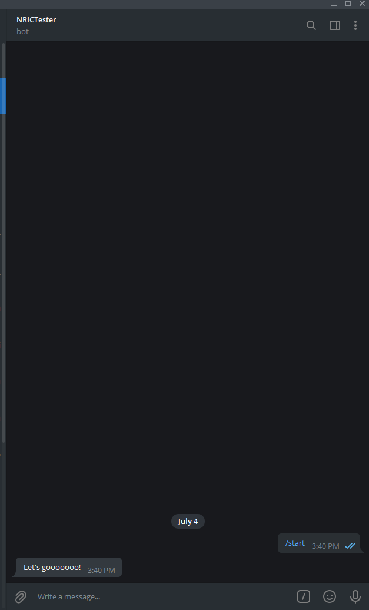
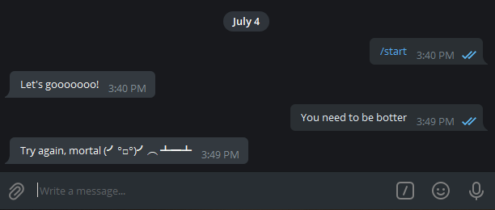
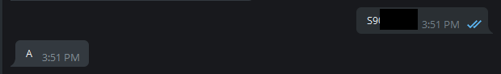
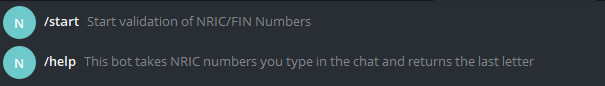

# NRICTest 
 
An experiment to validate NRIC/FIN numbers using Telegram as the interface.

Run the command below to install the library in the folder containing the rest of the files.

>`pip install python-telegram-bot`

Run main.py
Once the bot is running, the bot can be contacted on Telegram at @NRICTesterBot

Commits to this repo will notify me on Telegram as well via a Github bot on Telegram that tracks this repo.

Have fun with it. Stay safe.

-----------------------------------------------------------------------------------------------------------------------------------------------------------------------------

## What does it do - 
 
Run the main.py file (I run it from Visual Studio Code) and it should show the following. You want to look for the "Botted" output.

Once you have done that, go ahead and look for @NRICTesterBot on your Telegram client. When you first start the bot, it should respond with text that corresponds to the /start command, in this case "Let's goooooo!" (this can be changed in main.py).

The bot will only run the checking function when it detects an input that fits the format I have coded in. Otherwise, the bot will mock you.

When the bot does detect an NRIC/FIN number, it will spit back the last letter that would make the NRIC/FIN valid.

The bot also responds to Telegram based commands. For this bot, /start and /help calls up other ways of interacting with the bot. This is done through Telegram's bot creation process with some code in main.py that corresponds to what each command should do.

The checking function checks the validity of the NRIC and spits back the last letter that would make the NRIC/FIN valid.
A valid NRIC/FIN doesn't actually mean its in use. Its valid but may not be issued.
The implication of that is you can actually create hypothetical NRIC/FIN of someone born in 2030.

-----------------------------------------------------------------------------------------------------------------------------------------------------------------------------

The bot can be adapted to be used to run any other function, you just have to edit what responses the bot gives based on the text the user sends. This can be done in the following bits of code on line 23 to 30 in main.py.
 
    def responses(input_text):
    user_message = str(input_text).upper()

    if user_message[0] in "STFG" and len(user_message)==8:
        return (generate_last_letter(user_message))
    else : 
        return ("Try again, mortal "+"(╯°□°)╯︵ ┻━┻")
 

## Change History
 
v1.0 - First commit  

v1.01 - Minor improvements  

v1.1 - added code for Telegram bot API  

v1.11 - Minor improvements  

v1.12 - Minor updates in an attempt to get code working  

v1.a - Branched the main code to try a different method for calling the Telegram Bot API  

v1.2 - Updates  

v.1.13 - Can't remember what I did  

v2 - First Working Version on the main branch  

v2.01 - Added arguments for format of text Bot will process in the checking function  

v2.02 Comments added to notate what each chunk of code does, updates to Readme as well.  

v2.03 Fun added  

v2.04 More readme updates, addition of Images folder for screenshots  

 
### Known Issues 
 
The Telegram Bot's token is stored in the constants file. Although it is not immediately visible on the source code, it is still technically hard-coded in. This is not a secure way to store keys.
